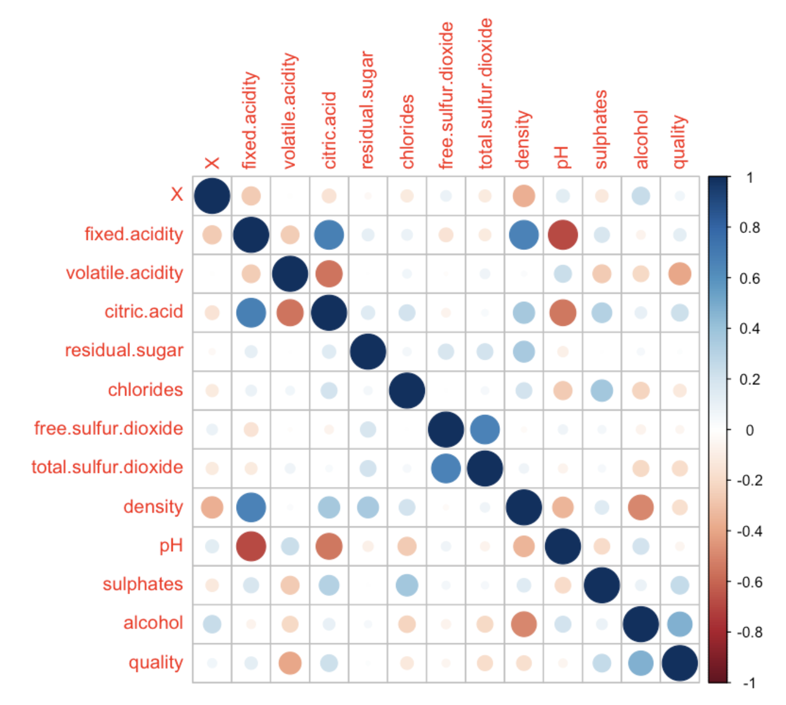
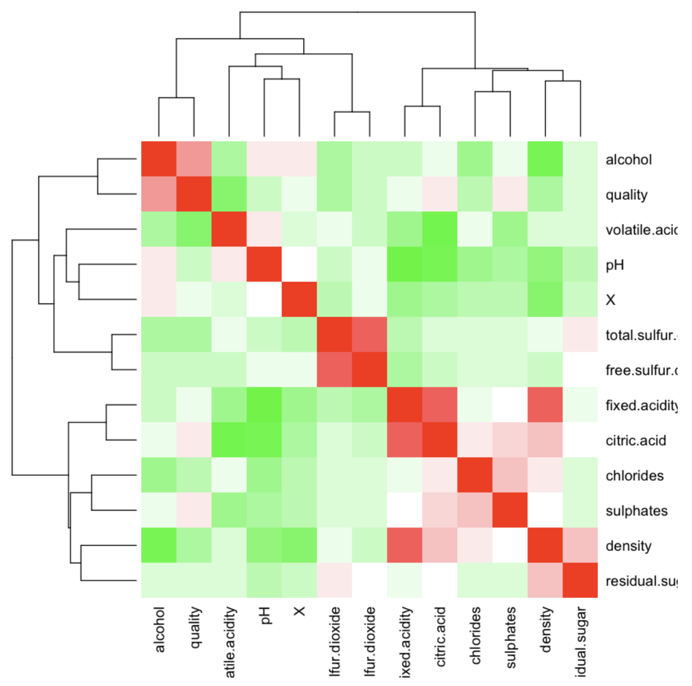
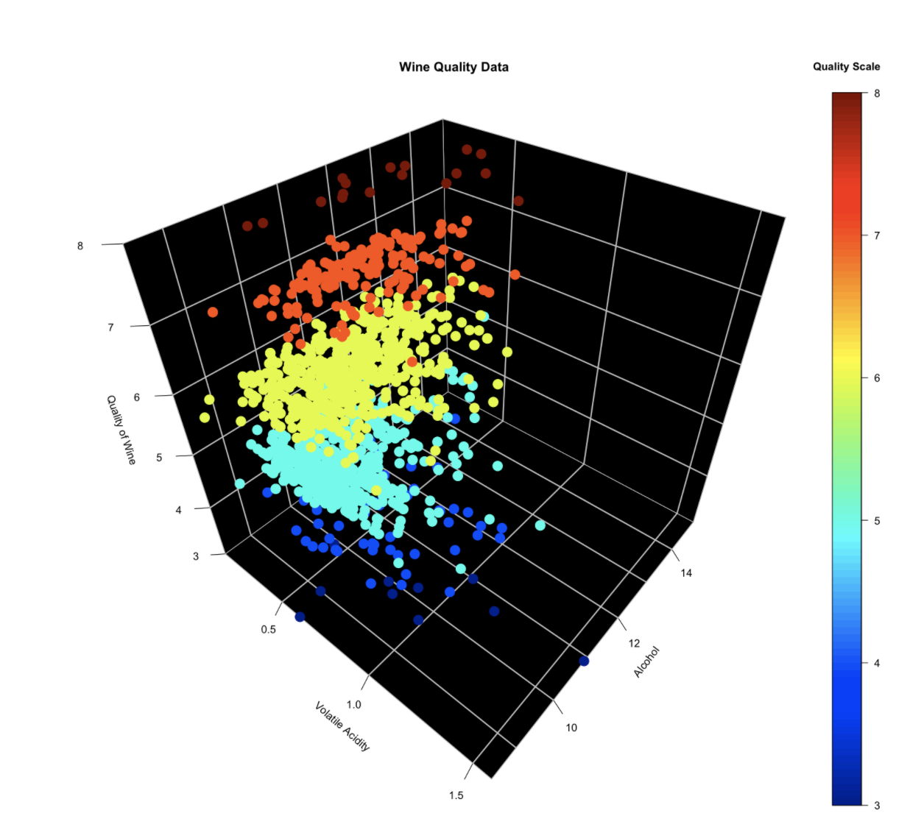

# Wine Quality Data Correlation¶
In this project we will evaluate data of different wine qualities ranging from 3 - 8 where 3 is the worst quality wine and 8 is the best quality wine in the given dataset. We will explore the data and try to find if there is any coorelation of wine quality with any other factor like, alcohol content, ph value, density, acitidy etc.

This will involve creating correlograms, heat maps, and 3D scatter plotting

